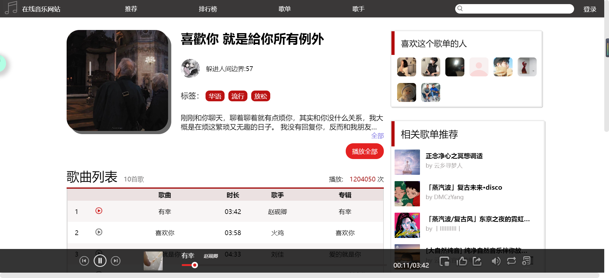

# cloud-music

## 项目功能
* 音乐播放（切歌、播放列表、播放进度、播放音量、歌词展示、歌曲播放模式）
* 搜索（搜索结果包括单曲、歌手、专辑、歌单）
* 各详情页面展示（歌手、专辑、歌单、用户主页）
* 用户相关（登录、收藏歌曲）

## 安装步骤
```
<!-- 后端接口：本项目api的是 Binaryify 后端api 地址: https://github.com/Binaryify/NeteaseCloudMusicApi -->
git clone https://github.com/Binaryify/NeteaseCloudMusicApi
node app.js

<!-- 前端展示 -->
git clone https://github.com/xiaobaigogo/music.git
npm install
npm run serve
```

## 项目截图
## 首页

## 排行榜

## 歌单

## 歌单详情

## 歌手

## 搜索

## 登录


## 特别感谢
Binaryify https://github.com/Binaryify
coderps123 https://github.com/coderps123/music